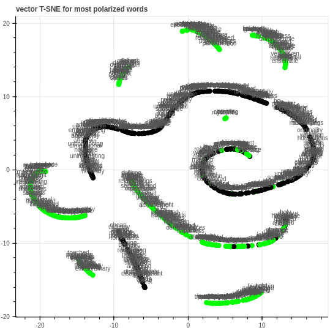

# movie-sentiment

A Neural Network [sentiment analysis](https://en.wikipedia.org/wiki/Sentiment_analysis) for [IMDB](http://www.imdb.com/) movie reviews (i.e. given a long string of movie review, classify the movie review as positive or negative) using mostly [Numpy](http://www.numpy.org/)

## How to Use

Simply open [`sentiment-analysis.ipynb`](https://github.com/adsasmita/movie-sentiment/blob/master/sentiment-analysis.ipynb) in any desktop browser, or you can download and run the cells in a Python 3 environment.

The code is presented in a [Jupyter Notebook](https://github.com/jupyter/notebook) / iPython notebook for readability purposes.

## Overview

The predictive theory in this project is validated by using simple count-based heuristics. This method were able to identify words with both positive and negative correlation to the output data.

## Dimensionality Reduction Visualization

At the end of the project, visualization of vectorized words using [Bokeh](http://bokeh.pydata.org/en/latest/) is also included.

The green scatterplot represents words that are more associated with positive IMDB movie reviews (such as "beauty", "stunning", and "masterpiece"). The black scatterplot, on the other hand, indicates words more associated with negative IMDB movie reviews (such as "horrible", "stupid", and "terrible").

## Dataset

The data is scraped from 25,000 [IMDB](http://www.imdb.com/) movie reviews in the text file `reviews.txt`

For training the data, the pre-assigned labels (whether the human-generated text review is positive or negative) is also contained in the text file `labels.txt`

## Dependencies

* [Numpy](http://www.numpy.org/) for all matrix calculation
* [SciKit-Learn](http://scikit-learn.org/) for [manifold TSNE](http://scikit-learn.org/stable/modules/generated/sklearn.manifold.TSNE.html) dimensionality reduction function
* [Bokeh](http://bokeh.pydata.org/en/latest/) and [matplotlib](http://matplotlib.org/) for data visualization

